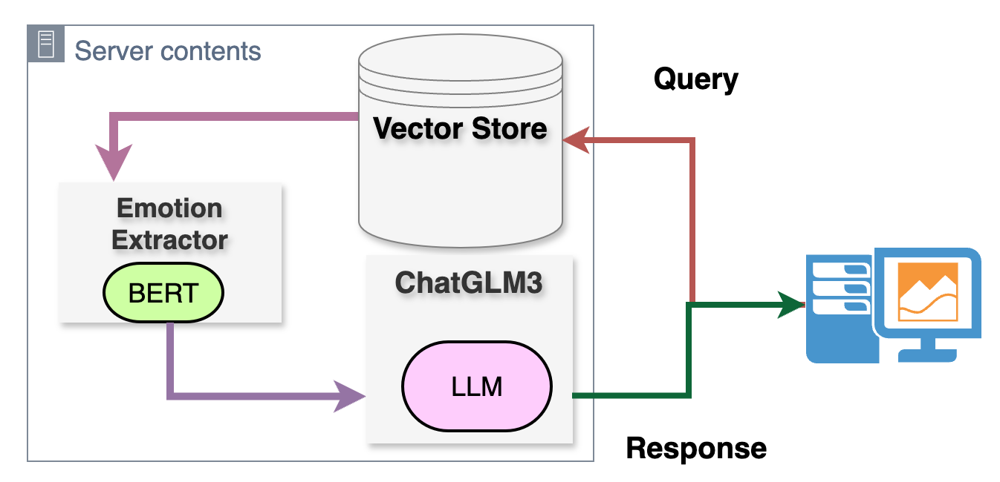
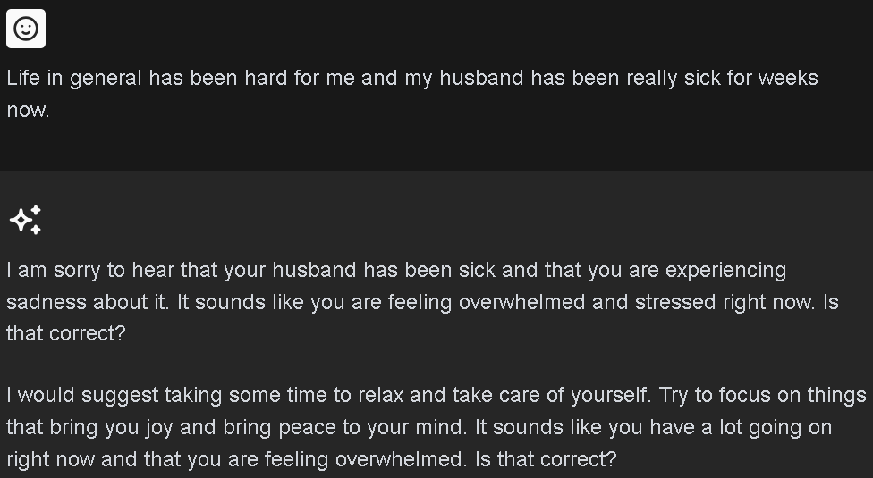
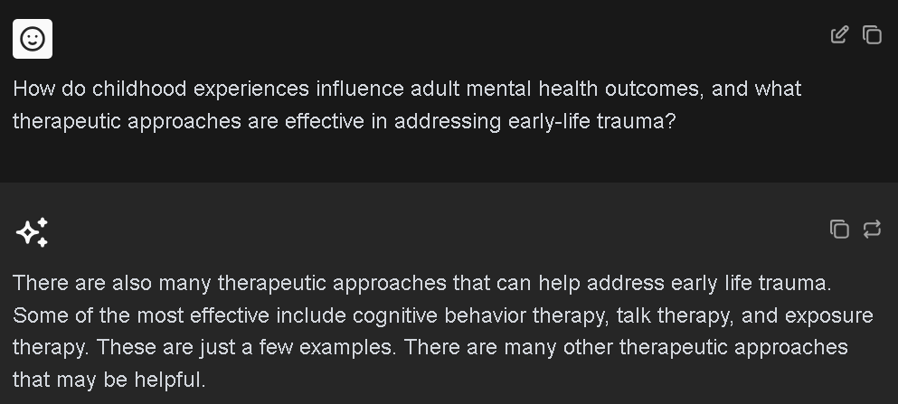

# Update3
[Back to the Home Page](./index)

## Update Overview

During this update phase, we mainly focus on Integrating three modules—Vector Store, Emotion Extractor, and ChatGLM3—into a pipeline and deploy them on the AutoDL server. Design and implement a web interface using React. We've achieved the following milestones:

## 1. Backend
The backend of the MindWellChat system is built around a robust architecture using FastAPI, ensuring efficient and scalable API services. At its core, the backend integrates a Vector Store for contextual information retrieval, an Emotion Extractor powered by BERT models for sentiment analysis, and the ChatGLM3 model fine-tuned for empathetic multi-turn conversations. Upon server initialization, the models are readied for operation. The system offer a API that, when called from the frontend with user inputs and system prompts, processes these inputs through the integrated models. The server then returns the chatbot's responses to the user while also maintaining a dialogue history for reference. This streamlined workflow facilitates a seamless user experience and supports the delivery of responsive and empathetic mental health support.
### 1.1 System prompt

#### Chinese
用户输入了关于其情感困扰的信息，请以同理心和支持性的方式回应。注意不要直接重复用户的话语，而应提供帮助性的建议、情绪支持或解决方案。请尽量理解用户的情绪状态，并给予恰当的情感反馈和有益的指导.

#### English
When a user enters information about their emotional distress, respond in an empathetic and supportive manner. Be careful not to repeat the user's words directly, but instead provide helpful suggestions, emotional support, or solutions. Try to understand the user's emotional state and provide appropriate emotional feedback and helpful guidance.

### 1.2 User prompt

#### English
        support_text = (
            "Although the provided documents may contain some noise, they still offer some useful support knowledge, and require yourself to analysis and get the useful information: "
            + doc_text
        )
        user_prompt = (
            f"User: {user_input}. Detected emotion: {emotion} (This emotion analysis may not be completely accurate and should be used as a reference)."
            f"Relevant document excerpt: '{support_text}'. When responding, please focus primarily on the user's question. Use the emotion and document information as supplementary references,"
            f" to ensure that the response is both insightful and relevant."
        )

#### Chinese
        support_text = (
            "尽管提供的文档可能包含干扰信息，它们仍提供一些有用的相关知识，需要你自己去分析来得到有效信息："
            + doc_text
        )
        user_prompt = (
            f"用户: {user_input}。系统检测到的情绪: {emotion}（此情绪分析可能不完全准确，仅供参考）。"
            f"相关文档摘要：'{support_text}'. 在回应时，请将主要注意力放在用户的问题上。请使用情绪和文档信息作为辅助参考，"
            f"以确保回答既理解深刻又相关性高。"
        )

#### Detailed
{user_input} is what the user enters

{emotion} is the emotion extracted based on user input

{doc_text} is a related file retrieved using RAG technology based on user input

{support_text} is the retrieved related file plus a prompt word

## 2. Frontend
Our chatbot front-end pages are developed using the React framework and TypeScript language, ensuring that the code is robust and maintainable. React provides an efficient component-based development model that makes user interfaces more responsive and extensible. TypeScript enhances the type checking of your code and reduces runtime errors. Data is stored in Supabase, and chat conversations are generated and managed by calling backend APIs for real-time data synchronization and secure storage. The entire project supports Docker containerized deployment, simplifying environment configuration and application distribution, and improving development and O&M efficiency.
#### Here are some actual illustrations

